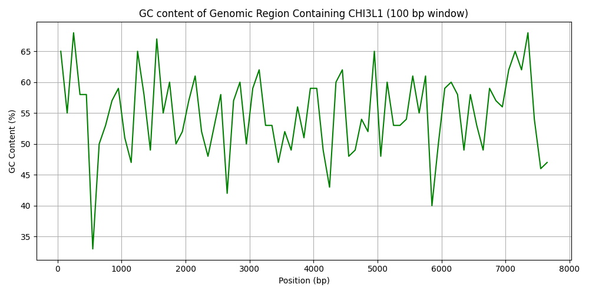

# GC Content Analysis in CHI3L1 (Bioinformatics Mini Project)
# 📌 Overview
This project analyses the CHI3L1 gene region from the human genome (chr1:203178000–203184000, GRCh38.p14) to study local variation in GC content.
The analysis was implemented in Python using Biopython for sequence parsing and matplotlib for visualisation.
# 🧬 Files in this Folder
data_CHI3L1_sequence.fasta → input FASTA sequence (downloaded from NCBI Genome Data Viewer)
gc_content_CHI3L1.py → Python script to compute and plot GC content
gc_content_CHI3L1.png → output plot of GC% variation
requirements.txt → required Python libraries
# 🚀 Workflow
Extract the CHI3L1 gene sequence from NCBI Genome Data Viewer.
Parse the FASTA sequence using Biopython.
Calculate GC content in 100 bp non-overlapping windows.
Plot local GC% variation using matplotlib.
Export the final plot as a .png file.
# ▶️ Usage
Clone the repository and install dependencies:
git clone https://github.com/shounakkadam27/bioinformatics-python-projects.git
cd bioinformatics-python-projects/gc-content-chi3l1
pip install -r requirements.txt
Run the script:
python gc_content_CHI3L1.py
# 📊 Output
After running the script, you will get a plot of GC content across the CHI3L1 region (chr1:203178000–203184000) in 100 bp windows.

# 🎯 Skills Demonstrated
Biological data retrieval (NCBI Genome Data Viewer)
FASTA parsing with Biopython
GC content analysis in sliding windows
Scientific data visualisation with matplotlib
Documentation and reproducibility
# 📖 References
NCBI Genome Data Viewer – Homo sapiens chromosome 1, GRCh38.p14
Biopython Documentation
